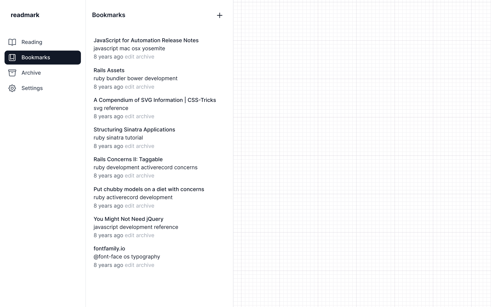

# Readmark

This is the full source code for [Readmark](https://readmark.fly.dev), a bookmarking site.

## Overview

### Features

- Simple and clean interface with a mobile-first responsive design
- Basic bookmark management, tagging, bookmarklets
- Import and export from and to Netscape Bookmark file
- Send-to-Kindle functionality with automatic daily/weekly digests

## Installation

[Elixir 1.13+](https://elixir-lang.org/install.html) and [Go 1.19+](https://go.dev/doc/install) is required.

- Build the application with `make`
- Start Phoenix endpoint with `make server`

Now you can visit [`localhost:4000`](http://localhost:4000) from your browser.

## Running tests

Run the tests with `make test`, or with `make test.coverage` for coverage.

## Built with

- [Elixir](http://elixir-lang.org/) programming language
- [Phoenix Framework](https://www.phoenixframework.org/)
- [Tailwind CSS](https://tailwindcss.com/)
