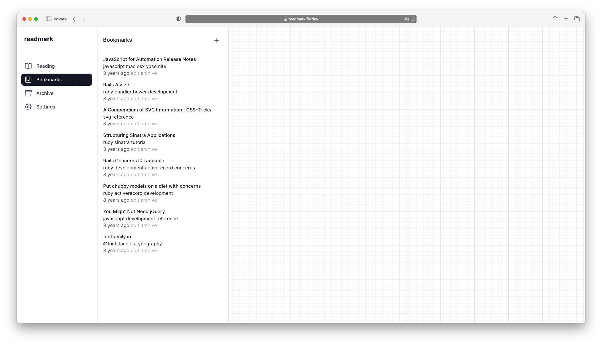

# Readmark

This is the full source code for [Readmark](https://readmark.fly.dev), a bookmarking site.

## Overview

### Features

- Simple interface with a mobile-first responsive design
- EPUB generation with Send-to-Kindle functionality and automatic daily/weekly digests
- Basic bookmark management, tagging, bookmarklets
- Import and export from and to Netscape Bookmark file

## Installation

- Build the application with `make`
- Start Phoenix endpoint with `make server`

Now you can visit [`localhost:4000`](http://localhost:4000) from your browser.

## Running tests

Run the tests with `make test`, or with `make test.coverage` for coverage.

## Tech

- [Phoenix](https://www.phoenixframework.org/) web framework and [Elixir](http://elixir-lang.org/) programming language
- [PostgreSQL](https://www.postgresql.org/) as the application database
- [`epub`](./native/epub) generator written as a Rust NIF
- [`readability`](./go_src/readability) binary exposes the [go-readability](https://github.com/go-shiori/go-readability) package which is used to clean up the HTML content

## Disclaimer

_This is a toy project built for educational purposes, not intended to be used in production._
